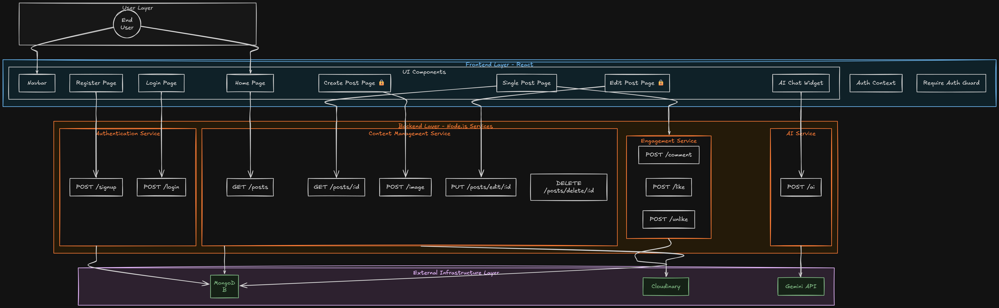

# 🚀 Blog Platform

Welcome to the **Blog Platform**!  
Create, share, and explore blog posts with images, comments, likes, and even an integrated AI chatbot! 🤖✨

---

## 🌐 Live Demo

- **Frontend:** [https://blogapp-sumitksr.vercel.app/](https://blogapp-sumitksr.vercel.app/)
- **Backend:** [https://blogapp-yakt.onrender.com](https://blogapp-yakt.onrender.com)

---

## 📦 Project Structure

```
blog-platform/
  ├── backend/   # Express.js API, MongoDB, Cloudinary, AI Chatbot
  ├── frontend/  # React.js, Tailwind CSS, Modern UI
  └── readme.md  # (this file)
```

---


## 🗺️ System Flow Diagram

The following flowchart shows the complete workflow of the Blog Platform, including authentication, blog management, comments, likes, image uploads, and AI chatbot integration.

<p align="center">
  
</p>

### Flow Overview

1. User accesses the React frontend.
2. Authentication is handled through Login/Register pages.
3. Authenticated users can:
   - Create blog posts
   - Upload images via Cloudinary
   - Like and comment on posts
   - Manage their own content
4. Frontend communicates with the Express.js backend through REST APIs.
5. Backend handles:
   - Authentication & Authorization
   - Blog CRUD operations
   - Comments & Likes
   - Cloudinary image storage
   - AI Chatbot requests
6. Data is stored in MongoDB.
7. AI Chatbot responses are generated through the Gemini API.

---

## 🛠️ How to Run Locally

1. **Clone the repo:**
   ```bash
   git clone https://github.com/sumitksr/BlogApp.git
   cd blog-platform
   ```

2. **Start the backend:**
   ```bash
   cd backend
   npm install
   npm start
   ```

3. **Start the frontend:**
   ```bash
   cd ../frontend
   npm install
   npm start
   ```

4. **Visit:**  
   - Frontend: [http://localhost:3000](http://localhost:3000)
   - Backend: [http://localhost:5000](http://localhost:5000) (default)

---

## ⚠️ Note About Hosting Delays

> ⏳ **If you're using the hosted backend on Render, the first request after a while may take up to 50 seconds!**  
> This is normal for free Render services (they "sleep" when not in use). Please be patient and try again if you get a timeout.

---

## ✨ Features

- 📝 Create, edit, and delete blog posts with images
- 💬 Comment and like posts
- 🔒 Authentication (register/login)
- ☁️ Image uploads via Cloudinary
- 🤖 **AI Chatbot**: Ask questions on any page!
- 🎨 Beautiful, responsive UI with Tailwind CSS

---

## 📂 More Info

- [Backend README](./backend/readme.md)
- [Frontend README](./frontend/README.md)

---

> Happy blogging! 🚀 
